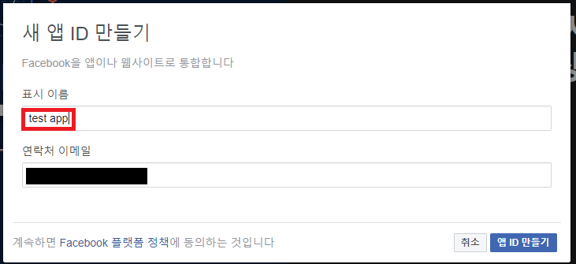
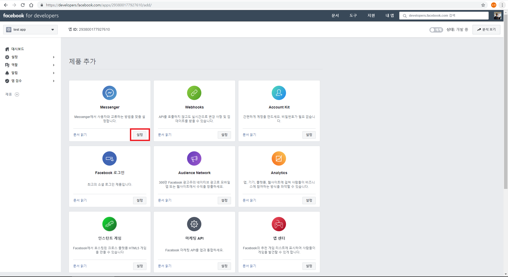
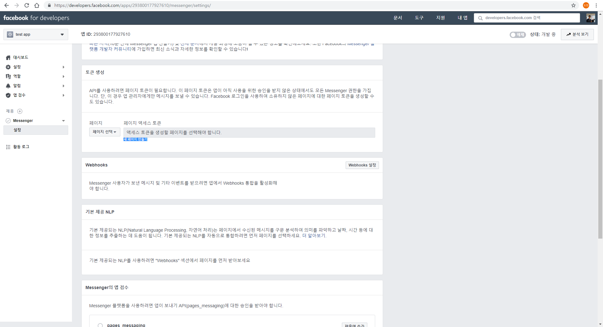
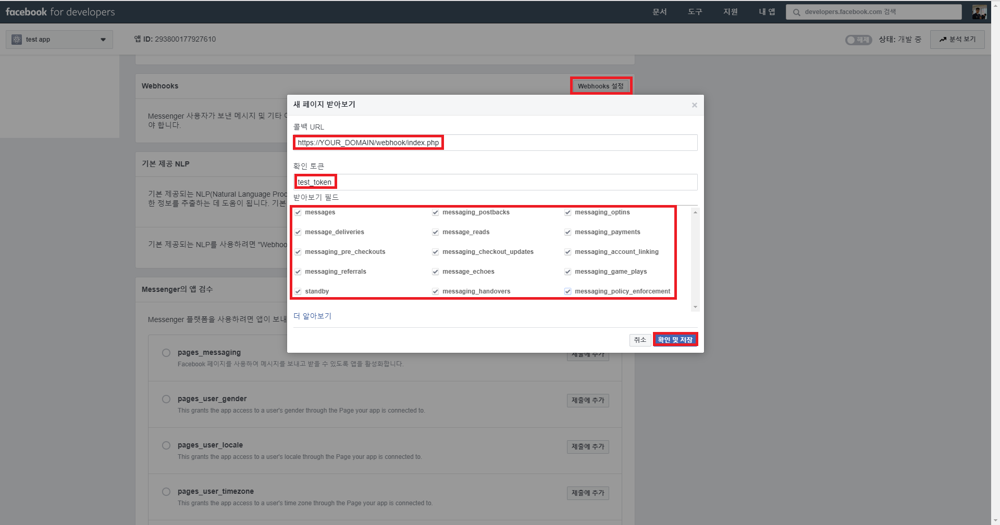
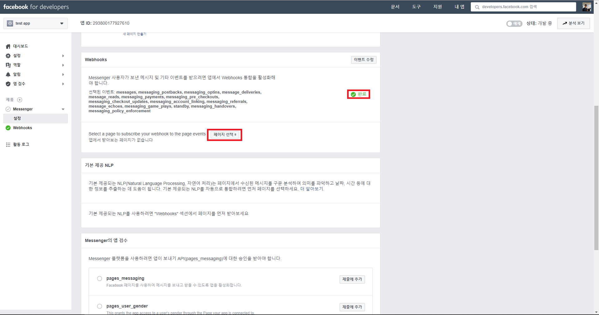

# fb-messenger-php-QuickStart
**Facebook-Messenger-API Simple Example**  
**페이스북 메신저 api 활용 앵무새(?) 만들기**  


페이스북 chatbot을 만들고 싶은 사람들을 위한 가이드.  
페이스북의 가이드는 nodejs로 작성되었습니다.  
nodejs를 사용하는 사람은 앞부분만 보다가 페이스북의 자체 가이드를 보시길 추천합니다.  
현 페이지의 개발 언어는 php입니다.
***

## 준비물
- 도메인
- 도메인이 호스팅되어있는 서버
- SSL

페이스북에서는 보안상 SSL을 필수로 하는 것 같습니다.  

이 가이드는 아파치 서버와 php환경에서 작동합니다. 다른 환경은 잘 모르겠습니다.  

>최대한 상세하게 과정을 기록하였고, 반환값이나 필요한 값을 정리해 놨으니 api 개발 경험이 없으신 분도 잘 따라할수 있으리라 믿습니다. 저도 외부 api를 이용한 개발 경험은 전무합니다. (이번이 처음입니다.)  
***

### 1. 페이스북 my app 만들기  

먼저 개발 전, <https://developers.facebook.com/> 에 접속해서 로그인하고, 우측 상단에 내 앱에서 새 앱을 만들어 줍시다.

  

 이름을 입력하고 보안 확인을 완료하면, 여러 앱들을 추가할 수 있는 창이 뜹니다. 어차피 필수로 필요한 것들은 자동으로 추가해주니, 맨 처음에 있는 messenger만 "설정" 버튼을 눌러줍시다.  

    

 일단 여기까지 오고, 페이스북에서 자신의 페이스북 페이지를 만들어야 합니다. 지금 만드는 페이지에서 메세지가 전송되고, 이 페이지로 들어오는 메세지를 자신의 서버로 연결시킬 수 있습니다. 그냥 빈 페이지 하나만 있으면 됩니다. 페이지 유형에 비즈니스 or 커뮤니티를 설정하라고 나오는데 아무거나 상관없습니다.  

 그다음, 아까 보았던 개발자 페이지로 돌아가서 페이지를 새로고침 해줍니다. 밑으로 내려가서 **"토큰 생성"** 섹션에 페이지에 있는 셀렉트 박스에서 연결할 페이지를 선택해줍니다. 그러면 자동으로 페이지 액세스 토큰을 보여줍니다. (상황에 따라 다시 권한을 본다는 창이 뜨는것 같습니다. 계속 버튼 눌러주면 됩니다.)  



 여기까지만 하면 일단 my app은 설정된겁니다. 이제 Webhook으로 페이지와 도메인을 연결시켜 봅시다.

### 2. Webhook 설정

 개발자 페이지에서 webhooks 섹션 우측 상단 Webhooks 설정을 누르면 이런 모달창이 뜹니다. 콜백 URL은 facebook messenger가 여러 요청을 보내는 위치입니다. 저는 webhooks라는 새로운 폴더를 만들어 관리합니다.

> 가끔씩 https://YOUR_DOMAIN/webhook/index.php 나 https://YOUR_DOMAIN/webhook 나 같은거 아냐? 하면서 뒤에 /index.php 빼시는 분들도 있는데, 이러면 /index.php로 리다이렉트 되면서 중간에 정보를 잃는 것 같습니다. 저도 겪었던 오류입니다.

 그다음 확인 토큰을 써줍니다. 이 토큰은 아까 봤던 페이지 토큰과 굳이 같을 필요는 없습니다. 하지만 기왕 복사한거 확인 토큰은 페이지 토큰을 씁시다. 어차피 나중에는 페이지 토큰으로 바꿔야 합니다.
 
  받아보기 필드는 여러 서비스를 설정하는것 같습니다. 음.. 나중에 추가도 가능하니 체크하기 귀찮으신 분들은 중요해 보이는 messages, message_reads 등만 체크하고 넘어갑시다.



 이제 코드를 복사할 시간입니다. index.php, lib.php, MessengerApi.php를 복사해서 여러분의 서버 폴더에 webhook 폴더를 만들어 넣어봅시다.

 그다음, facebook_token.txt의 내용을 수정해 줍니다. 아까 나온 페이지 토큰을 복사해서 붙여넣기 하시면 됩니다.

 > 참고로 https를 안쓰고 http를 쓰거나, 위에 말한대로 redirect 되었거나, 에러가 발생하면 /var/log/apache2/error.log, /var/log/apache2/access.log 등을 보고 해결해 줍시다.
 그러면 모달창이 닫히면서 페이스북 developer 페이지가 새로고침 됩니다.
 
   
 
 이렇게 완료 표시가 뜨면 성공입니다. 그다음 바로 밑에 페이지 선택 셀렉트박스에서 메세지를 수신받는 페이지를 선택해주고, 받아보기 버튼을 누르면 됩니다. 아까 만든 페이지면 충분하겠네요.  
 
 자! 이제 최소한의 내용은 끝났습니다. 자신의 계정으로 자신의 페이지에 메세지를 보내면 같은 문장의 메세지가 반송됩니다! 단, 다른 사람들도 이 페이지를 이용하기 위해선, facebook에서 앱을 제출해서 심의를 받아야 합니다. 이제 메세지를 받아서 해석하고 반송하는 원리를 알아봅시다.
 ***

### 3. 코드 해석

**다시 webhook 설정 부분으로 돌아가봅시다.**  

 아까 webhook 설정에서 확인 및 저장을 누르면 facebook에서 콜백 URL로 HTTP REQUEST를 보냅니다.
 
```
  GET /webhook2/index.php?hub.mode=subscribe&hub.challenge=1984364894&hub.verify_token=*YOUR_TOKEN* HTTP/1.1" 200 3395 "-" "facebookplatform/1.0 (+http://developers.facebook.com)
```
 query string을 해석하면
 * hub.mode=subscribe
 * hub.challenge=1984364894
 * hub.verify_token=*YOUR_TOKEN*
 정도가 되겠네요. *YOUR_TOKEN* 자리에는 여러분이 아까 "확인 토큰" 자리에 써넣은 토큰이 올겁니다. hub.mode는 facebook webhook을 테스트 하기 위한 요청이라는 뜻이고, verify token은 말그대로 제대로된 요청인지 확인하기 위한 토큰, hub.challenge가 바로 우리가 반환해줘야 할 값입니다.  
 
 이제 요청이 나에게 온것이 맞는지 hub.mode와 hub.verify_token으로 확인하고, hub.challenge 값을 "HTTP/1.1 200 OK" 와 함께 보내주면 됩니다. 코드를 보면서 설명드리겠습니다. index.php의 상단부분 코드입니다.
 
```
  <?php

  require_once 'lib.php';
  require_once 'MessengerApi.php';
  // webhook 인증만 할때 이 두 require_once 문은 제거해도 됩니다. 메세지를 보낼게 아니라면 아직 필요없는 api 입니다.


  $token = file_get_contents('facebook_token.txt');
  // 아까 받았던 페이지 확인 토큰을 써줍시다. 저는 가로스크롤 생기는게 싫어서 다른곳에 저장해두고 가져오는 방식을 썻습니다.
  define('TOKEN', $token);    //굳이 필요한 작업은 아닙니다.

  $query = $_SERVER['QUERY_STRING'];    // get 요청을 가리키는 글로벌 변수입니다.
  parse_str($query,$output);    // (String)$query를 배열로 쓰기 좋게 (Array)$output에 담아줍니다.
  // webhook
  $mode = $output['hub_mode'] ?? null;
  $challenge = $output['hub_challenge'] ?? null;
  $verify_token = $output['hub_verify_token'] ?? null;
  //query string을 분해합니다. parse_str 함수는 hub.challenge같은 키에서 . 를 _ 로 escape 하더군요. 

  if ($mode && $verify_token) {     // hub.mode와 hub.verify_token이 존재한다면 (query string이 존재한다면)
    if ($mode === 'subscribe' && $verify_token === $token ) {     // hub.mode가 subscribe인지 확인, 토큰 확인
      header("HTTP/1.1 200 OK");     // 200 OK를 보내줍니다.
      header('Content-Type: text/plain');     // 값을 echo 해주기 위해 text/plain 해더를 붙여줍니다.
      echo $challenge;    // 값을 echo(반환) 해줍니다.
    }
  }
```

***
 
 **메세지 수신  전송**
 
 메세지가 올때마다 https://YOUR_URL/webhook/index.php에 이 REQUEST가 전송됩니다.
 
 ```
  66.220.149.21 - - [30/Nov/2018:13:47:40 +0900] "POST /webhook/index.php HTTP/1.1" 200 3395 "-" "facebookexternalua"
 ```
 
 body를 parse해보면
 다음과 같은 JSON이 옵니다.
 
 ```
  {
    "entry": [
      {
        "id": "1234567891234567",
        "messaging": [
          {
            "message": {
              "mid": "zeAnBegPdRSAPIZsSRT5thsHlOwmyL71L8o-biTNA1UAZHOPNJLIUsuHfsw87qzagJR0qWuTvWCGPPyq8omMDw",
              "nlp": {
                "entities": {}
              },
              "seq": 211865,
              "text": "안녕하세요?"
            },
            "recipient": {
              "id": "1234567891234567"
            },
            "sender": {
              "id": "7654321987654321"
            },
            "timestamp": 1543322502083
          }
        ],
        "time": 1543322502932
      }
    ],
    "object": "page"
  }
 ```
 
 이 JSON을 php 에서 받아봅시다. 다음 코드는 index.php 의 하단입니다.
 
 ```
  // receive messages

  $inputJSON = file_get_contents('php://input');    // php에 REQUEST된 POST의 내용을 $inputJSON에 저장합니다 (BODY PARSE)
  $input = json_decode($inputJSON, TRUE);     // 기존에 String이였던 POST의 내용을 php 연관 배열로 디코딩합니다.

  if ($input['object'] === 'page') {    // 요청이 메세지인지 확인합니다.
    header('HTTP/1.1 200 OK');    // 일단 HTTP/1.1 200 OK 헤더를 달아줍니다.
    $api = new MessengerApi();    // MessengerApi.php에 MessengerAPI를 받아옵니다.
    $msgs = $api->receiveMSG($input['entry']);    // 위에 JSON 형식을 참고해서 보기좋게 가공합니다. MessengerApi.php의 Message 클래스를 참고하세요.
    foreach ($msgs as $msg) {
      $api->sendMessage($msg->sender,$msg->text); // 받은 메세지를 모두 반송합니다.
    }
  }
 ```
 
 이 부분은 단순히 받은 메세지들을 구조화해서 반송하는 내용이니 MessngerApi.php로 넘어갑시다
 
 메세지를 반송하려면 다음과 같은 JSON 텍스트를 https://graph.facebook.com/v2.6/me/messages 에 보내야 합니다.
 
```
  {
    "messaging_type": "RESPONSE",
    "recipient": {
      "id": 받는사람
    },
    "message": {
      "text": 텍스트
    }
  }
```

 그리고 Query String에는 페이지의 액세스 토큰을 넣어주면 됩니다.

```
  https://graph.facebook.com/v2.6/me/messages?access_token=페이지엑세스토큰
```

 이제 어떻게 구현이 되었나 봅시다.

#### MessengerApi 클래스
```
  /**
   * Messenger Api
   */
  class MessengerApi
  {
    public function receiveMSG($entrys)     // 위의 JSON 파일의 entry 배열을 파싱합니다..
    {
      $msgs = [];
      foreach ($entrys as $entry) {
        foreach ($entry['messaging'] as $msg) {
          $msgs[] = new Message($msg);    // 받은 메세지들을 Message 클래스에 담아서
          __log(new Message($msg),'receiveMSGS.txt');
        }
      }
      return $msgs;   // 반환합니다.
    }
    
    public function sendMessage($receiver,$content)     //메세지 보내기
    {
      $request = array(
        'messaging_type' => 'RESPONSE',
        'recipient' => array(
          'id' => $receiver
        ),
        'message' =>  array(
          'text' => $content
        )
      );    위 형태의 request할 json을 만들어 줍니다.
      
      __log(json_encode($request),'temp.txt');
      
      $url = 'https://graph.facebook.com/v2.6/me/messages?'.http_build_query(array('access_token'=>TOKEN));   // request를 보낼 URL 입니다.
      $ch = curl_init();    // curl을 초기화합니다.
      curl_setopt_array($ch, array(
        CURLOPT_HTTPHEADER => array('Content-Type: application/json'),
        CURLOPT_URL => $url,
        CURLOPT_POST => 1,
        CURLOPT_POSTFIELDS => json_encode($request),
        CURLOPT_RETURNTRANSFER => true
      ));     // curl을 셋팅합니다.
      $content = curl_exec($ch);    //curl을 실행하고, $content에 반환값을 담습니다.
      __log($content,'curlResult.txt');     // 반환값을 기록합니다.
    }
  }
 ```
 
 lib.php는 __log함수밖에 없기도 하고 딱히 설명이 필요한 부분은 아니라고 판단해서 딱히 설명하지는 않겠습니다.
 
 github 마크다운에서 코드에 주석처리가 안되는게 좀 아쉽네요. 친절히 설명한다고 주석을 덕지덕지 달아놨더니 코드랑 섞여서 보기가 영...  
 혹시 보기 불편하시면 코드를 복사하거나 저장소에 있는 코드 clone 하셔서 에디터에서 보시면 될 것 같습니다.